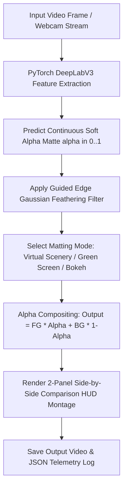

<div align="center">

# 🎬 Real-Time AI Background Matting

### *Day 18 — 30-Day Computer Vision & Deep Learning Challenge*

[](https://www.python.org/)
[](https://pytorch.org/)
[](https://opencv.org/)
[](LICENSE)
[](https://github.com/manasha1232)

*Real-time video alpha matting and virtual background replacement engine using PyTorch DeepLabV3, continuous soft alpha matte prediction, guided edge feathering, and studio scenery compositing.*

---

</div>

## 📌 Overview

The **Real-Time AI Background Matting** system isolates human subjects in video streams and replaces complex backgrounds with custom virtual landscapes (e.g. tropical sunset beach), studio green screens, or heavy DSLR bokeh portrait blurs while preserving fine boundary details such as hair strands and clothing outlines.

### 🎯 Key Capabilities & Matting Modes

| Mode | Visual Effect | Description |
| :--- | :---: | :--- |
| **Virtual Background (`virtual_bg`)** | 🌅 | Replaces background with synthetic sunset beach landscape |
| **Studio Green Screen (`green_screen`)** | 🟩 | Replaces background with studio chroma key neon green |
| **DSLR Bokeh Blur (`bokeh`)** | 📸 | Applies heavy $35 \times 35$ Gaussian blur to background |

---

## 🏗️ System Architecture & Processing Pipeline



---

## 📁 Repository Structure

```text
realtime_ai_background_matting/
├── ai_background_matting.py       # Core matting engine & HUD renderer
├── generate_demo_matting_video.py# Synthetic office matting video generator
├── requirements.txt               # Dependency declarations (torch, torchvision, opencv, numpy)
├── README.md                      # Project documentation
├── input/                         # Input video dataset
│   └── sample_matting_video.mp4
└── output/                        # Processed output video & JSON matting report
    ├── sample_matting_video_matting_output.mp4
    └── sample_matting_video_matting_report.json
```

---

## ⚡ Quickstart & Installation

### 1. Install Dependencies
```bash
pip install -r requirements.txt
```

### 2. Generate Synthetic Test Video
```bash
python generate_demo_matting_video.py
```

### 3. Run AI Background Matting (Virtual Sunset Beach)
```bash
python ai_background_matting.py --input input/sample_matting_video.mp4 --output output --mode virtual_bg
```

### 4. Studio Green Screen Mode
```bash
python ai_background_matting.py --input input/sample_matting_video.mp4 --mode green_screen
```

---

## 📊 Telemetry Output Specification

```json
{
    "video_source": "sample_matting_video",
    "total_frames_processed": 180,
    "total_time_seconds": 10.53,
    "average_fps": 17.1,
    "matting_mode": "virtual_bg",
    "mean_subject_alpha_coverage_pct": 1.95,
    "output_video": "output/sample_matting_video_matting_output.mp4"
}
```

---

## 👤 Author & Challenge Context

- **Challenge**: Day 18 of [30-Day Computer Vision & Deep Learning Challenge](https://github.com/manasha1232/30-Day-Computer-Vision-Challenge)
- **Author**: [@manasha1232](https://github.com/manasha1232)
- **License**: MIT License
